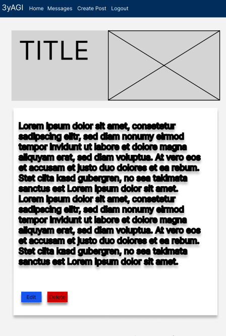

# Portfolio Project 4 - Full-Stack Toolkit

## Title: 3yAGI

## Live Site

[Go to application](https://my-blog-with-django-60cc368e0bbd.herokuapp.com/)

## Repository

[View repository](https://github.com/ThePyth0nKid/pp4-myblog)

---

## Catalouge

<li><a href="#about-the-project">About the Project</a></li>
<li><a href="#planing">Planing</a></li>
<li><a href="#target-group">Target Group</a></li>
<li><a href="#user-experince">UXD - User Experince Design</a></li>
<ul><li><a href="#storytelling">Storytelling</a></li>
<li><a href="#wireframe">Wireframe</a></li>
</ul>
<li><a href="#user-stories">User Stories</a></li>
<li><a href="#surface-plan">The Surface Plan</a></li>
<ul>
<li><a href="#base">Base</a></li>
<li><a href="#blogger-overview">blogger Overview</a></li>
<li><a href="#reader-overview">Reader Overview</a></li>
</ul>
<li><a href="#database-design">Database Design</a></ul>
<li><a href="#testing">Testing</a></li>
<li><a href="#deployment">Deployment</a></li>
<li><a href="#technologies-used">Technologies</a></li>
<li><a href="#credits">Credits</a></li>
<li><a href="#acknowledgements">Acknowledgements</a></li></ul>

---

<h2 id="about-the-project">About the Project</h2>
"3yAGI," or "3 Years to AGI," stands as my fourth portfolio project during my journey as a Full-Stack Software Developer student at the Code Institute. This endeavor was particularly significant as it aimed to develop a Minimum Viable Product (MVP) utilizing agile software development methodologies. Central to this endeavor was the effective digital management of agile methods through GitHub, ensuring transparent and efficient project steering.

To facilitate a comprehensive understanding of the development process, I invested in a whiteboard, which became a cornerstone tool. Through practical application of agile methods, I continuously designed, updated, and refined the project, documenting progress via photo documentation for thorough visualization.

At the core of 3yAGI lies a blog website developed with Django for backend functionality and Bootstrap for frontend design. A PostgreSQL database ensures robust data management, while Cloudinary serves as the platform for image storage. The blog provides a platform for bloggers and readers to exchange experiences, insights, uncertainties, and reflections not only within software development but also across the spectrum of Artificial Intelligence (AI) and Artificial General Intelligence (AGI).

An intriguing aspect of this project is its temporal dimension. "3yAGI" symbolizes a three-year journey aimed at tracking and reflecting on advancements in AI and AGI. It serves as a tangible representation of evaluating the feasibility of achieving AGI within this timeframe. Consequently, this project represents both technological progression and personal development, encapsulating the ethos of learning, sharing, and evolving within the domains of software development and AI research, with a primary focus on delivering a robust Minimum Viable Product.

<h2 id="planing">Planing</h2>

### Effective Digital Project Management with Agile and GitHub

In the execution of my project, I fully leveraged the tools and methods available to me: the whiteboard and GitHub. These tools enabled me to effectively apply agile methodologies, ensuring a transparent and efficient approach to project management. Despite careful planning and the use of these modern aids, I encountered numerous unforeseen insights that were not part of my original plan.

### Adaptation and Learning: The Art of Agile Development

Agile development teaches us to be flexible and to quickly respond to changes. Following this principle, I found myself revisiting and restructuring user stories, and deeply reflecting on them. This iterative process brought many new learning experiences and affirmed the motto "Fail Fast, Learn Fast". An important realization that proved true in my project was: "There is always more to build than you have time for." Despite these challenges, I planned and executed my project to the best of my knowledge and ability.

### From Wireframes to UX: A Holistic Approach

In developing my project, I began with wireframes to outline the visual structure, then delved into User Experience Design (UXD) to ensure the application was both functional and user-friendly. Recognizing the importance of understanding user needs, I immersed myself in user stories, tailoring the design and functionality to meet those needs effectively.

To enhance this process, I integrated flowcharts and Entity-Relationship Diagrams (ERD). Flowcharts helped visualize the user journey, identifying opportunities to streamline their experience. The ERD contributed to a solid database design, ensuring data was organized efficiently and relationships were clearly defined, supporting the application's backend architecture.

These components—wireframes, UX considerations, user stories, flowcharts, and ERD—were thoroughly documented in the README file. This documentation not only guided the project's progression but also served as a learning tool for continuous improvement.

### Conclusion: A Path of Continuous Learning

I hope for understanding for the imperfections that have emerged on this learning journey. Every step, including missteps, has deepened my understanding and advanced my development as a software developer. I look forward to the learning opportunities ahead and to applying and expanding my skills and knowledge in future projects.

---

<h2 id="target-group">Target Group</h2>

The target group for the "3yAGI" project includes software developers and AI enthusiasts, as well as tech enthusiasts, students, and the general public interested in exploring software development and artificial intelligence.

### Blogger

As blogger, you can publish your posts, sharing your thoughts and experiences in the realm of software development and artificial intelligence. Here, you have the opportunity to document your personal insights, challenges, and reflections, engaging in discussions with the readers. You can also read and respond to comments from readers, fostering interactive exchange and dialogue.

### Reader

As a reader, you can sign up to posts and write comments. You can explore Blogger's perspectives and opinions, benefiting from his experiences. On this page, you can stay updated on the latest developments in artificial intelligence, learn about current trends, and share your own thoughts and questions. Your comments can contribute to lively discussion and constructive exchange with Nelson and other readers.

---

<h2 id="user-experince">UXD - User Experince Design</h2>
To enhance user experience on my blog focused on Artificial General Intelligence (AGI), I crafted a narrative illustrating a potential user journey.

As a foundation for the project, I developed wireframes based on user stories.

<h3 id="storytelling"></h3>
Max is an aspiring developer with a keen interest in artificial intelligence, particularly in the development of Artificial General Intelligence (AGI).

When he discovers my blog about AGI, Max is thrilled by the articles and discussions about the latest advancements and challenges in this field. He decides to delve deeper into the subject and learn more about how AGI could influence the future.

Through the posts on my blog, Max gains insights into various aspects of AGI development, from fundamental concepts to ethical and societal implications. He is impressed by the diversity of topics and the quality of information he finds on my blog.

After reading several articles, Max decides to reach out to an AGI development firm mentioned in a post on my blog. He visits their website to learn more about their work and projects, and he is impressed by what he sees.

Max can deepen his knowledge of AGI and actively engage in discussions about it.

<h3 id="wireframe">Wireframes</h3>
The wireframes are intended to provide an initial overview of how the project's design will be implemented, with an emphasis on keeping it simple. They are based on the user stories and have been created using Figma. Inspired by the Code Institute's walkthrough project, Codestar, these visual drafts are a key part of the design process. They allow for the planning of the interface's placement and layout before starting the actual development. By using wireframes and drawing inspiration from Codestar, the aim was to sketch and refine ideas in a straightforward and effective manner.

### User Views

### Blogger Views

---

<h2 id="user-stories">User Stories</h2>

* As a **blogger** I can **create a new blog post** so that **I can share my thoughts and experiences with my audience**.
* As a **user**, I can **register for an account** so that **I can have a personalized experience on the blog platform**.
* As a **reader**, I can **view blog posts** so that **I can stay informed about the blogger's content**.
* As a **reader**, I can **leave comments on blog posts** so that **I can share my thoughts and engage with the content**.
* As a **blogger**, I can **delete blog posts** so that **my blog remains organized and trustworthy**.
* As a **blogger**, I can **edit my existing blog posts** so that **I can keep my content up-to-date and accurate**.
* As a **reader**, I can **leave comments on blog posts** so that **I can share my thoughts and engage with the content**.
* As a **reader** I can **easily find and use a "Contact Me" feature,** so that **I can quickly get in touch with the website owner for inquiries, feedback, or support**.
* As a **user**, I want the blog website to be **accessible and user-friendly on various devices** so that **I can enjoy a seamless experience regardless of the device I'm using**.
* As a **registered user** I can **edit and delete my comments** so that **can correct mistakes or remove outdated information**.
* As a **blogger** I can **enhance my blog posts with images** so that **I can visually engage and communicate with my audience**.
* As a **blogger** I can **access and view messages sent through the 'Contact Me' form** so that **I can efficiently manage and respond to user inquiries and feedback**.
* As a **reader** I can **view a paginated list of blog posts** so that **I can easily navigate through the content and explore multiple posts without overwhelming scrolling.**.
* As a **visitor to the website** I can **view the 'About Me' page** so that **I can learn more about the website owner, their background, interests, and professional journey.**.
* As a **user/reader** I can **bookmark or save my favorite blog posts** so that **can easily revisit and share them later**.

<h2 id="surface-plan">The Surface Plane</h2>

<h3 id="base">Base</h3>
To maintain a consistent layout throughout the application, Django dynamic pages are used for the navbar and footer.

### Navbar

The website's navigation bar is designed to be classic and simple, ensuring an intuitive user experience. On the very left, visitors are greeted with the website's title, which also serves as a home button, allowing for an easy return to the homepage at any time. Right next to the title, the options "Home," "Register," and "Login" are available for quick access. On the far right, a succinct description offers insight into what the site offers, guiding newcomers and briefly highlighting the available content. This minimalist design approach not only facilitates navigation but also emphasizes the site's key features and content, ensuring users can effortlessly find what they are looking for.

### Footer

The footer of the website is kept very simple and includes "Made by: Nelson Mehlis" alongside social media links, which are represented by classic icons. This minimalist approach ensures a clean and uncluttered user experience, while still providing essential information and quick access to social networks.

<h3 id="homepage">Homepage</h3>

### Hero and About

On the homepage, visitors are greeted with a welcome text that doubles as a brief "About Me" section, explaining to new visitors what the site is about. Below this introduction, prominently featured as a hero image, is the latest post. This layout ensures that newcomers immediately understand the purpose of the site and are instantly drawn to the most recent content, highlighting the site's focus and inviting engagement right from the start.

### Post List/Page 2

The homepage features two distinct designs: The first page includes an "About"/Welcome text, a prominently featured hero post, and a small list of up to three posts in a smaller display. When navigating to the second page and beyond by pressing the "Next" button, the About/Welcome text and the hero post disappear. Instead, six posts are displayed as cards. This transition from the introductory page to the content pages shifts the focus more towards the variety and depth of the content offered, moving from an initial introduction to a broader display of posts.

### Sign Up

The sign-up page maintains the website's theme of simplicity, mirroring the straightforward design of the other pages. At the top, there's a text asking if an account already exists, accompanied by a text link next to it saying "then please sign in." Below this prompt, the page is structured to collect new user information in a clear sequence: first, a field for the username, followed by email, then the password, and finally, a repeat password field for confirmation. This layout ensures a user-friendly experience, guiding newcomers through the registration process with ease.

### Login

Its easy to login for returning user. Just fill in your username and password and you get logged in.

<h3 id="blogger-overview">Blogger Overview</h3>

### Blogger Navbar

When logged in as a Blogger, Superuser, or Admin – embodying all these roles in one – the navigation bar displays the options "Home," "Messages," "Create Post," and "Logout." Clicking on "Messages" takes you to a page where all the messages sent by readers or logged-in users are displayed. Selecting "Create Post" redirects to a page where a new post can be created. These features provide an efficient way to interact with the community and publish content on the platform.

### Create New Post

On the "Create Post" page, bloggers/superusers are greeted with the heading "Create New Post." Directly below this, there is a text field labeled "Title" for entering the post's title. Below the title field, there's an option to select and upload an image from the blogger's/superuser's device to serve as the hero image for the post. Following the image upload option, there is a large text field for the main content of the post. Below the content field, there's another field labeled "Excerpt" for a brief summary or excerpt of the post. Next, there is a field "Updated On," which serves to indicate the last update or creation date of the post. Finally, at the bottom of the page, there is a "Create Post" button to submit the new post. This layout is specifically designed to provide bloggers and superusers with a smooth and organized process for creating posts.

### Edit And Delete Post

The "Edit" and "Delete" buttons for posts are color-coded to ensure they can be easily distinguished without needing to read them: the "Edit" button is blue, and the "Delete" button is red. This color scheme helps users intuitively recognize the functions and reduces the likelihood of confusion by providing visual cues for the respective actions.

The "Edit Post" page, at this stage of the project, does not differ from the "Create New Post" page, except that when you press "Edit" on a post, you are taken to the "Create New Post" page with pre-entered data. Currently, it functions, but with compromises to user-friendliness, as the image field does not automatically populate with the name of the previously used picture. Additionally, I have integrated Summernote into my content field. I designed a custom widget. This widget lacks many functions but is responsive in design and includes everything I believe is necessary for beginners to effectively use the feature. If it turns out that users need more functionality, I would adjust it in future iterations. Currently, the "Updated On" also needs to be manually changed.

Clicking on the "Delete" button prompts a confirmation asking if you really want to delete the post, ensuring an additional layer of security against accidental deletions.

### Messages

On the "Messages" page, there is a list of individual messages that include the sender's name, email, subject, message, and the creation date ("Created At"). If there are no messages present, the page displays "No Messages," indicating that the inbox is currently empty. This setup ensures a clear and organized view of communications for the user, allowing for easy review and management of incoming messages.

<h3 id="reader-overview">Reader Overview</h3>

---

<h2 id="database-design">Database Design</h2>
On this project postgresql is used with ElephantSQL

[Database Diagram]()

### Key Models

### Blog

*
*
*

---

<h2 id="testing">Testing</h2>
Link to the testing document.

[TESTING.md](https://github.com/ThePyth0nKid/pp4-myblog/blob/main/TESTING.md)

---

<h2 id="deployment">Deployment</h2>

The Code Institute student template was used to create this project.

[Code Institute Full Template](https://github.com/Code-Institute-Org/ci-full-template)

* Click the "Use This Template" button.
* Give your repository a name, and description if you wish.
* Click the Create Repository from Template to create your repository.
* Click the Gitpod button to create a gitpod workspace, this can take a few minutes.
* When working on project using Gitpod, please open the workspace from Gitpod, this will open your previous workspace rather than creating a new one.
* Use the following commands to commit your work,
git add . - adds all modified files to a staging area.

git commit -m "A short message exlaining your commit" - commits all changes to a local repository.

git push - pushes all your commited changes to your Github repository.

* Before making the first commit:
PLEASE MAKE SURE NEVER TO PUBLISH SECRET KEYS, ADD THE env.py TO A .gitignore TO AVOID PUSHING KEYS TO GITHUB.

### Heroku Deployment

1. Log into Heroku
2. Create a new app, choose a location closest to you
3. Search for Heroku Postgres from the resources tab and add to your project
4. Make sure to have dj_database_url and psycopg2 installed.

pip3 install dj_database_url
pip3 install psycopg2

5. Login to the Heroku CLI - heroku login -i
6. Run migrations on Heroku Postgres - heroku run python manage.py migrate
7. Create a superuser - python manage.py createsuperuser
8. Install gunicorn - pip3 install gunicorn
9. Create a requirements.txt file - pip3 freeze > requirements.txt
10. Create a Procfile (note the capital P), and add the following,

web: gunicorn my_project.wsgi

11. Disable Heroku from collecting static files

heroku config:set DISABLE_COLLECTSTATIC=1 --

1. Add the hostname to project settings.py file

ALLOWED_HOSTS = []

1. Connect Heroku to you Github, by selecting Github as the deployment method and search for the github repository and pressing

connect

14. In Heroku, within settings, under config vars select

Reveal config vars

15. Add the following

DATABASE_URL = URL to the database
CLOUDINARY_URL = URL to cloudinary
SECRET_KEY = The secret key

16. Commit and push in your CLI

git add .
git commit -m "Initial commit"
git push

17. Go back to the Deploy tab and press

Deploy Branch

18. Your deployed site can be launched by clicking Open App from its page within Heroku.

*During production Heroku Postgresql was no longer availible and therefore DATABASE_URL in Heroku Config Vars was changed to the ElephantSQL Postgres url.*

---

<h2 id="technologies-used">Technologies Used</h2>

* [HTML](https://sv.wikipedia.org/wiki/HTML)
* [CSS](https://en.wikipedia.org/wiki/CSS)
* [Javascript](https://www.javascript.com/)
* [Python](https://www.python.org/)
* [Django](https://www.djangoproject.com/)
* [ElephantSQL](https://www.elephantsql.com/)
* [Bootstrap](https://getbootstrap.com/)
* [Heroku](https://id.heroku.com/login)
* [Cloudinary](https://cloudinary.com/)
* [Github](https://github.com/)
* [Codeanywhere](https://app.codeanywhere.com/)
* [Techsini](https://techsini.com/multi-mockup/index.php)

---

<h2 id="credits">Credits</h2>

#### Code

*

*

#### Bootstrap

#### Django

#### Issues with code

<h2 id="acknowledgements">Acknowledgements</h2>
