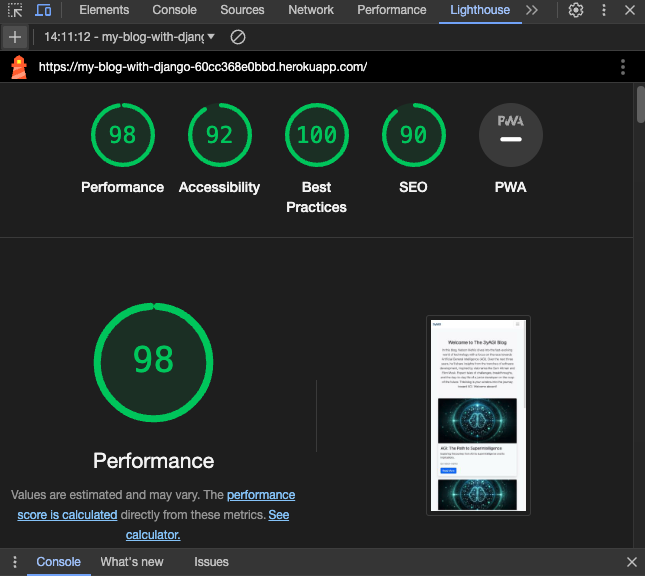
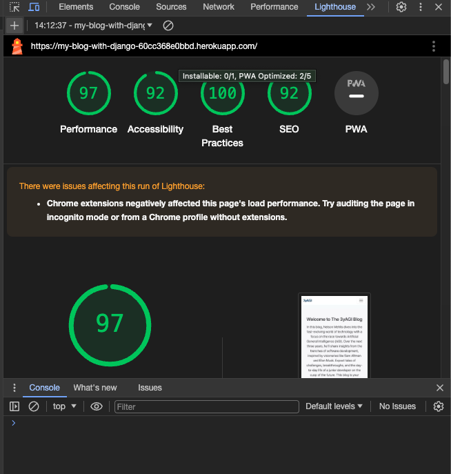

[Back to README](https://github.com/ThePyth0nKid/pp4-myblog/blob/main/README.md)

---

## Testing Catalouge

<li><a href="#user-stories">User Stories Testing</a></li>
<ul>
<li><a href="#one">User Authentication</a></li>
<li><a href="#two">Responsive Design</a></li>
<li><a href="#three">View Paginated List of Posts</a></li>
<li><a href="#four">Read Blog Post</a></li>
<li><a href="#five">Commenting System</a></li>
<li><a href="#six">Comment Editing and Deletion</a></li>
<li><a href="#seven">Create Blog Post</a></li>
<li><a href="#eight">Update Blog Pos</a></li>
<li><a href="#nine">Delete Blog Post</a></li>
<li><a href="#ten">Upload Images to Blog Post</a></li>
<li><a href="#eleven">Admin Dashboard for Viewing Contact Messages</a></li>
</ul>
<li><a href="#manual-testing">Manual Testing</a></li>
<ul>
<li><a href="#navigation-bar">Navigation Bar</a></li>
<li><a href="#footer">Footer</a></li>
<li><a href="#homepage">Homepage</a></li>
<li><a href="#signup">Signup Page</a></li>
<li><a href="#signout">Signout page</a></li>
<li><a href="#login">Login</a></li>
<li><a href="#post-detail-reader">Post Detail Reader</a></li>
<li><a href="#contact-me">Contact Me</a></li>
<li><a href="#navigation-bar-blogger">Navigation Bar Blogger</a></li>
<li><a href="#post-detail-blogger">Post Detail Blogger</a></li>
<li><a href="#messages">Messages</a></li>
</ul>
<li><a href="#validation">Validation</a></li>
<ul>
<li><a href="#validation">W3C HTML Validator</a></li>
<li><a href="#validation">W3C CSS Validator</a></li>
<li><a href="#validation">JSHint Javascript Validator</a></li>
<li><a href="#validation">PEP8 Python Validator</a></li>
</ul>
<li><a href="#lighthouse">Lighthouse Testing</a></li>
<li><a href="#bugs">Bugs</a></li>

---

<h2 id="user-stories">User Stories Testing</h2>

---

## Base Stories Testing

<h3 id="one">As a user, I can register for an account so that I can have a personalized experience on the blog platform.</h3>

Acceptance Criteria 1: The registration page should ask for a unique username and password.

Acceptance Criteria 2: Upon successful registration, I should receive a confirmation.

Acceptance Criteria 3: I should be able to log in with my registered credentials.

Test result: The user registration works without bugs. I've tested signing up with a username and password, attempting to register with invalid data. All fields function as they should, displaying a warning for invalid input, and registration can only proceed with valid input.

<h3 id="two">As a user, I want the blog website to be accessible and user-friendly on various devices so that I can enjoy a seamless experience regardless of the device I'm using.</h3>

Acceptance Criteria 1: The website should adjust its layout and design based on the device's screen size.

Acceptance Criteria 2: Navigation and content should be clear and easy to interact with on desktop, tablet, and mobile.

Test result: The design has been tested on all common devices with the Chrome DevTool and shows no bugs. The image on the post detail page disappears on small devices, but this is intentional.

## Reader Stories Testing

<h3 id="three"></h3>As a reader I can view a paginated list of blog posts so that I can easily navigate through the content and explore multiple posts without overwhelming scrolling.

Acceptance Criteria 1: On the main blog page or a designated blog section, there should be a list of blog posts.

Acceptance Criteria 2: The list should be divided into pages, with a specific number of posts displayed per page.

Acceptance Criteria 3: Each page should include clear navigation options, such as "Previous" and "Next" buttons, to move between pages.

Acceptance Criteria 4: The current page number or position within the paginated list should be displayed for reference.

Acceptance Criteria 5: Clicking on a blog post title or preview should take me to the full content of that post.

Acceptance Criteria 6: If there are more posts than can fit on a single page, the platform should automatically generate and display additional pages.

Acceptance Criteria 7: The pagination system should ensure that the list remains organized and user-friendly, even as new posts are added to the platform.

Test result: I've tested that all acceptance criteria function as expected, and everything works without bugs. The only issue I've noticed is that even when there are no more posts available, the card for the hero/latest post is still rendered.

<h3 id="four">As a reader, I can view blog posts so that I can stay informed about the blogger's content.</h3>

Acceptance Criteria 1: On the main blog page, there should be a list of all published blog posts.

Acceptance Criteria 2: Clicking on a post title should take me to a page displaying the full content of that post.

Acceptance Criteria 3: Each blog post should show the publication date.

Test result: I've tested that as a reader, clicking on the "read more" button takes you to the correct post detail page and that all post-relevant metadata are displayed correctly. For the posts from my fixtures file, which I use as post examples, "noon" is displayed as the time, but this is only due to the JSON file. For newly created posts, everything is displayed correctly.

<h3 id="five">As a reader, I can leave comments on blog posts so that I can share my thoughts and engage with the content.</h3>

Acceptance Criteria 1: I can share my thoughts and engage with the content.

Acceptance Criteria 2: I should be able to enter my comment and submit it.

Acceptance Criteria 3: Comments should be displayed on the post.

Test result: I have tested that I, as a reader, can leave a comment on a post page and the comments are displayed correctly and without bugs.

<h3 id="six">As a registered user I can edit and delete my comments so that can correct mistakes or remove outdated information.</h3>

Acceptance Criteria 1: When I view a comment I've posted, I see an "Edit" button next to it.

Acceptance Criteria 2: When I click the "Edit" button, I can make changes to the content of my comment.

Acceptance Criteria 3: After editing, I can save my changes, and the comment will be updated with the new content.

Acceptance Criteria 4: I can only edit my own comments and not those made by other users.

Acceptance Criteria 5: When I view a comment I've posted, I also see a "Delete" button next to it.

Acceptance Criteria 6: When I click the "Delete" button, I am prompted to confirm the deletion.

Acceptance Criteria 7: After confirming the deletion, the comment is removed from the system and no longer visible to other users.

Acceptance Criteria 8: I can only delete my own comments and not those made by other users.

Test result: I have tested the function for editing a user's own reader comments, and everything works as expected. The only issue I noticed is that after editing a comment, the text remains in the text field.
Additionally, I have tested that a user can only delete their own comments and that when pressing the delete button, a confirmation modal appears. In this modal, a user can click "close" to cancel the process, and upon clicking "delete," the comment is removed. After deletion, a confirmation of the deletion appears below the navbar.

## Blogger Stories Testing

<h3 id="seven">As a blogger I can create a new blog post so that I can share my thoughts and experiences with my audience.</h3>

Acceptance Criteria 1: When I log in to the blog platform, I should see a "Create New Post" button.

Acceptance Criteria 2: The create post page should include fields for the title, content, and any relevant metadata.

Acceptance Criteria 3: After submitting the new post, it should be immediately visible on the blog.

Test result: I have tested that I, as a blogger, can create new posts. The function works as expected. What I noticed is that the Summernote widget's description of the function on the buttons is in an Asian language. Uploading images works well, but if images are uploaded in a format that is too large or too small, the image is cropped when displayed.

<h3 id="eight">As a blogger, I can edit my existing blog posts so that I can keep my content up-to-date and accurate.</h3>

Acceptance Criteria 1: Each blog post should have an "Edit" option on the main blog page.

Acceptance Criteria 2: Clicking on the "Edit" option should take me to an edit page with the current content of the post.

Acceptance Criteria 3: After updating a post, the changes should be immediately reflected on the main blog page.

Test result: I have tested that I, as a blogger, can delete and edit a post on the post detail page, and everything works as expected. When pressing the edit button, I am redirected to the create post page with pre-filled fields of the post to be edited. What stands out is that in the image field, the name of the current image is not displayed, but the function works. After updating the post, I am redirected back to the post page and receive a confirmation message at the top.

<h3 id="nine">As a blogger, I can delete blog posts so that my blog remains organized and trustworthy.</h3>

Acceptance Criteria 1: Each blog post should have a "Delete" option on the main blog page.

Acceptance Criteria 2: Clicking on the "Delete" option should prompt me for confirmation before removing the post.

Acceptance Criteria 3: After deletion, the post should be removed from the main blog page.

Test result: Upon clicking the delete button, I am prompted to confirm my deletion, which also works as expected.

<h3 id="ten">As a blogger I can enhance my blog posts with images so that I can visually engage and communicate with my audience.</h3>

Acceptance Criteria 1: On the blog post creation/edit page, there should be an option to upload images.

Acceptance Criteria 2: I should be able to select and upload one image from my local device.

Acceptance Criteria 3: The system should support common image formats such as JPEG, PNG, and GIF.

Acceptance Criteria 4: Uploaded images should be displayed within the blog post content.

Test result: Uploading images works well, but if images are uploaded in a format that is too large or too small, the image is cropped when displayed.

<h3 id="eleven">As a blogger I can access and view messages sent through the 'Contact Me' form so that I can efficiently manage and respond to user inquiries and feedback.</h3>
Acceptance Criteria 1: Ensure that there is a dedicated link in the navbar which is accessible only to admin and superuser accounts. This link should lead to a page or a section where messages from the 'Contact Me' form are listed.

Acceptance Criteria 2:On accessing the link, the admin/superuser should be presented with a list or table displaying the messages. This should include relevant details such as the sender's name, email and message content of the message submission.
Acceptance Criteria 3:Ensure that the message viewing functionality is secure and respects privacy. Only authorized admin or superusers should be able to view these messages.

Test result: I have tested that I, as a blogger, can see the messages sent to me through the "contact me" page by readers. Everything works as expected.

## User Stories (should and could) that are not done

As a user/reader I can bookmark or save my favorite blog posts so that can easily revisit and share them later.

As a user I can sign in to the blog platform using my Google account so that I can access the platform with minimal effort and use my existing Google credentials.

As a visitor to the website I can view the 'About Me' page so that I can learn more about the website owner, their background, interests, and professional journey.

---

<h2 id="manual-testing">Manual Testing</h2>

### General

<h3 id="navigation">Navigation Bar</h3>

* All links correctly redirect to the correct pages for visitors.
* Navbar is fully responsive on small/medium/large devices.
* Reader sees correct link "Contact Me" when logged in.
* Blogger sees correct links "Messages" and "Create Post" when logged in.
* Navbar collapse works on smaller devices.

<h3 id="footer">Footer</h3>

* All icon links work correctly.
* All links open in a new pag
* The footer appears at the end of the page.

<h3 id="homepage">Homepage</h3>

* All buttons work and links correctly.
* Icons are being displayed correctly.
* Images are displayed correctly.
* Good contrast between text/images/buttons.

<h3 id="signup">Signup page</h3>

* Username and password are required as expected.
* Email are optional.
* After a successful login, a confirmation message is displayed: "Successfully signed in as ..."
* The username cannot be assigned twice, and if one tries to register with a username that is already in use, a message will be displayed after the registration attempt: "A user with that username already exists."
* The password confirmation works correctly and shows a message when two different passwords are entered: "You must type the same password each time."
* The system also correctly identifies and notifies when a password is entirely numeric, displaying the message: "This password is entirely numeric."
* The system checks for passwords that are too similar to the user's other personal information and displays the message: "Your password can’t be too similar to your other personal information."
* The system requires passwords to have a minimum length and displays the message: "Your password must contain at least 8 characters."
* The system checks for commonly used passwords and will display the message: "Your password can’t be a commonly used password" if such a password is attempted.

<h3 id="signout">Signout page</h3>

* Upon attempting to sign out, the system will prompt with the message: "Are you sure you want to sign out?"
* After signing out, the system displays the message: "You have signed out."

<h3 id="login">Login page</h3>

* Form works as expected with username and password.
* After a successful login, a confirmation message is displayed: "Successfully signed in as ..."
* It is not possible to sign in with account data that does not exist.

### Reader

<h3 id="post-detail-reader">Post Detail Reader</h3>

* As a reader, you can write comments on the post detail page.
* The comments are displayed immediately after clicking the submit button.
* As a reader, you can only edit your own comments.
* The confirmation message "comment submitted" is displayed at the top, below the navbar.
* The reader can delete and edit their own comments, and only their own. There are no buttons for other comments.
* After editing, the comment is immediately displayed in the new, updated version.
* "Comment Updated!" A confirmation message is displayed at the top, below the navbar.
* After clicking on the delete button, a modal is opened where the deletion must be confirmed again.
* After clicking "close" in the modal, the deletion process is canceled.
* After clicking "delete" in the modal, the comment is deleted and no longer visible, and a confirmation message is displayed at the top, below the navbar.

<h3 id="contact-me">Contact Me</h3>

* When clicking on "contact me" in the navbar, the reader is redirected to a page where they can write a message to the blogger.
* It is not possible to send the message without having filled out the necessary fields.
* The email field must contain a valid email, or it will display a message indicating that the input is not an email.
* After successfully sending the message, the reader is redirected back to the homepage.
* After successfully sending the message, a message is displayed below the navbar: "Thank you! Your message has been sent."

### Blogger

<h3 id="navigation-bar-blogger">Navigation Bar Blogger</h3>

* As a blogger/superuser, the navbar displays "Home", "Messages", "Create Post", and "Logout".
* Upon clicking the links, I am taken to the respective page.

<h3 id="post-detail-blogger">Post Detail Blogger</h3>

* When I, as a blogger, click on the "read more" button on a post, I am redirected to the correct post detail page.
* On the post detail page, all buttons are displayed correctl.
* Upon pressing the edit button, I am redirected to the create post page where all fields are filled with the data from the post to be edited.
* Upon pressing the edit button, I am redirected to the create post page where all fields are pre-filled with the data from the post to be edited. However, the field for "currently" under images has a bug and does not automatically populate. Additionally, the "Updated on" field must be updated manually.
* After pressing the "create post" button, the edited post is correctly displayed.
* A message is displayed below the navbar: "Post '...' successfully updated!"
* Upon pressing the delete button, a confirmation is requested.
* Pressing "close" in the confirmation dialog cancels the deletion process.
* Upon clicking the delete button in the confirmation dialog, the post is immediately deleted, and the user is redirected back to the homepage.
* On the homepage, a confirmation of the post deletion is displayed.
* As a blogger/superuser, I can delete all comments.
* Upon clicking delete, a modal is displayed prompting me to choose between delete or close.
* Pressing "close" in the confirmation dialog cancels the deletion process.
* As a blogger/superuser, I can also leave comments.
* When clicking on edit, the "leave a comment" text field is filled with the text of the comment.
* After clicking on "update," the comment is correctly updated and immediately visibleh. The date remains the same.
* "Comment Updated!" is displayed as a confirmation of successful updating below the navbar.

<h3 id="messages">Messages</h3>

* When clicking on "messages" in the navbar, I am redirected to the messages page.
* On the messages page, I find the messages with all relevant data sent to me by readers from the "contact me" page.
* All messages are displayed correctly.
* Each message has a delete button next to it.
* Upon clicking delete, the message is deleted.
* After deleting, a message is displayed below the navbar: "Contact was successfully deleted."
* The message is no longer visible on the page.

<h3 id="create-post">Create Post</h3>

* After clicking on "Create Post" in the navbar as a blogger/superuser, I am redirected to a page where I can create a new post.
* All fields necessary to create a post must be filled out.
* Upon clicking on the image field, I can upload an image from my device.
* I can edit my text in the content field using Summernote. Bold, underline, unordered list, and ordered list functions work as expected.
* The excerpt field can be left empty.
* "Updated on" displays the server time.
* After pressing "Create Post," the post is created as expected.

---

<h2 id="validation">Validation</h2>

### [W3C HTML Validator](https://validator.w3.org/)

#### Check by address

* 0 Errors
* 0 Warnings

#### Check by text input

* 8 Errors
* 0 Warnings

When testing through text input with the W3C HTML validator, there were 8 error messages, all stemming from the Summernote widget. In the current phase, these could only be accepted and not debugged. However, all functionalities are still operational.

### [W3C CSS Validator](https://jigsaw.w3.org/css-validator/)

* 0 Errors
* 0 Warnings

### [JSHint Javascript Validator](https://jshint.com/)

#### Check by address

* 0 Errors
* 0 Warnings

#### Check by text input

* 0 Errors
* 27 Warnings

During code testing, a total of 11 warnings related to the use of ES6-specific features such as const for variable declarations, arrow functions (=>), and template literals were observed. These warnings are not indicative of incorrect or unexpected code; instead, they reflect adherence to modern JavaScript practices compliant with the ECMAScript 6 (ES6) standard.

### PEP8 Python Validator

* 0 Errors
* 0 Warnings

The python validator extension was used to test Python for Pep8 compliance with its built-in linting too.

* A lot of the Python errors were fixed during development.
Any errors related to files that were auto generated by Django were left untouched.
* Migration Files
* ./manage.py

<h3 id="lighthouse">Lighthouse Testing</h3>

#### On desktop for homepage

#### On mobile for homepage

---

<h2 id="bugs">Bugs</h2>

When there are no posts available, the Bootstrap card for the Hero post is still being rendered on the homepage.

In Summernote, the button descriptions are in an Asian script.

When updating comments on a post, the date remains the same.

When editing a post, the current image is not displayed

<h3 id="solved-bugs">Solved Bugs</h3>
---
